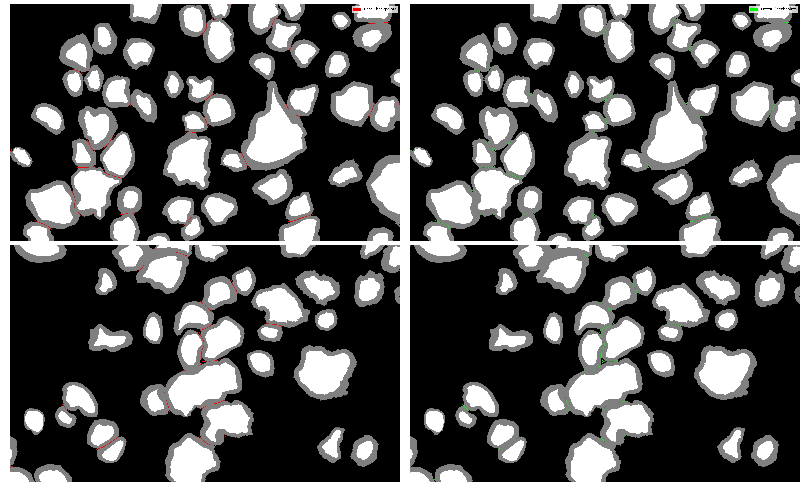

# nn_touching_myelin



**Figure 1:** Test results using both the best and latest checkpoints. These test images are from patient sub-nyuMouse07 in the TEM dataset.


This repository is dedicated to the task of converting the Touching Myelin Boundary Detection Dataset from the BIDS format to the format expected by nnUNetv2. The dataset can be found at [this location](https://github.com/axondeepseg/data_touching_myelin).

The repository also includes a training script for training the model with nnUNetv2.

The ultimate goal of this project is to enhance the instance segmentation as discussed in the following issues:
- [Issue #768](https://github.com/axondeepseg/axondeepseg/issues/768)
- [Discussion #766](https://github.com/axondeepseg/axondeepseg/discussions/766)

## Repository Structure

The repository contains the following key components:

- **Conversion Script**: This script is responsible for converting the Touching Myelin Boundary Detection Dataset from the BIDS format to the format expected by nnUNetv2. To run execute the following command: 
```bash
python scripts/convert_from_bids_to_nnunetv2_format.py <PATH/TO/ORIGINAL/DATASET> --TARGETDIR <PATH/TO/NEW/DATASET>
```

- **Pretty Print Dataset Script**: This script is used to display datasets in a pretty format following nnUNet's documentation. It can be useful when making changes to the code to ensure that the dataset is properly formatted. The script can be called by running the following command:
```bash
python scripts/pretty_print_dataset.py <PATH/TO/ORIGINAL/DATASET>
```

- **Training Script**: This script is used to train the model with nnUNetv2. To run execute the following command: 
```bash
./scripts/train_nnunet.sh
```


## Getting Started

To set up the environment and run the scripts, follow these steps:

1. Create a new conda environment:
```bash
conda create --name touching_myelin
```
2. Activate the environment:
```bash
conda activate touching_myelin
```
3. Install PyTorch, torchvision, and torchaudio. For NeuroPoly lab members using the GPU servers, use the following command:
```bash
conda install pytorch torchvision torchaudio pytorch-cuda=12.1 -c pytorch -c nvidia
```
For others, please refer to the PyTorch installation guide at https://pytorch.org/get-started/locally/ to get the appropriate command for your system.
4. Update the environment with the remaining dependencies:
```bash
conda env update --file environment.yaml
```
5. Run the conversion script (the default target directory is the current working directory):
```bash
export RESULTS_DIR="<PATH/TO/SAVE/RESULTS>"
```
6. Set up the necessary environment variables:
```bash
python scripts/convert_from_bids_to_nnunetv2_format.py <PATH/TO/ORIGINAL/DATASET> --TARGETDIR $RESULTS_DIR
```
7. Set up the necessary environment variables:
```bash
export nnUNet_raw="$RESULTS_DIR/nnUNet_raw"
export nnUNet_preprocessed="$RESULTS_DIR/nnUNet_preprocessed"
export nnUNet_results="$RESULTS_DIR/nnUNet_results"
```
8. Run the nnUNet preprocessing command:
```bash
nnUNetv2_plan_and_preprocess -d 1 --verify_dataset_integrity
```
## Training the Model

After setting up the environment and preprocessing the data, you can train the model using nnUNetv2. Run the following command:
```bash
./scripts/train_nnunet.sh
```

## Inference

After training the model, you can perform inference using the following command:
```bash
python scripts/nn_unet_inference.py --path-dataset ${RESULTS_DIR}/nnUNet_raw/Dataset001_MyelinBoundarySegmentation/imagesTs --path-out <WHERE/TO/SAVE/RESULTS> --path-model ${RESULTS_DIR}/nnUNet_results/Dataset001_MyelinBoundarySegmentation/nnUNetTrainer__nnUNetPlans__2d/ --use-gpu --use-best-checkpoint
```
The `--use-best-checkpoint` flag is optional. If used, the model will use the best checkpoints for inference. If not used, the model will use the latest checkpoints. Based on empirical results, using the `--use-best-checkpoint` flag is recommended.

## Contributing

We welcome contributions to this project. If you have a feature request, bug report, or proposal, please open an issue on our GitHub page.

## License

This project is licensed under the MIT License. See the LICENSE file for more details.